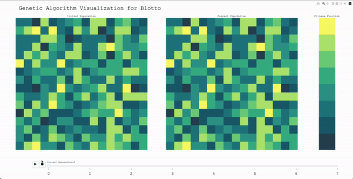

# CPSC 474: Computational Intelligence for Games - Final Project

## Collaborators
- Iris Yang (imy4)
- Grace Bu (gb598)
- Jackie Dong (jd2598)


# Important (Virtual Environment Setup):
- We have included our virtual environment folder called `venv`. The dependencies required for this program are `pandas`, `numpy`, and `plotly`. Before testing our implementation please execute `source venv/bin/activate`. If the virtual environment does not work please execute the following commands in order.

1) virtualenv -p /usr/bin/pypy3 venv
2) source venv/bin/activate
3) pip3 install numpy 
4) pip3 install pandas
5) pip3 install pd
6) Go to `png.py` in `venv/lib/pypy3.9/site-packages/_plotly_utils` and comment out lines 1217 - 1247 shown below
```
# row = next(t)
# del t

# testelement = row
# if "width" not in info:
#     width = len(row) // planes
#     info["width"] = width

# if "bitdepth" not in info:
#     try:
#         dtype = testelement.dtype
#         # goto the "else:" clause.  Sorry.
#     except AttributeError:
#         try:
#             # Try a Python array.array.
#             bitdepth = 8 * testelement.itemsize
#         except AttributeError:
#             # We can't determine it from the array element's datatype,
#             # use a default of 8.
#             bitdepth = 8
#     else:
#         # If we got here without exception,
#         # we now assume that the array is a numpy array.
#         if dtype.kind == "b":
#             bitdepth = 1
#         else:
#             bitdepth = 8 * dtype.itemsize
#     info["bitdepth"] = bitdepth

# for thing in ["width", "height", "bitdepth", "greyscale", "alpha"]:
#     assert thing in info``

```

# Usage
To run our program for Blotto, the first command line argument should be "--Blotto", the second argument should be the number of units, and the following arguments should be the scoring distribution. For example, `pypy3 ga_visualization.py --Blotto 1 2 3 4` will run Blotto with 1 unit and 3 battlefields with respective scores 2/3/4.

To run Cribbage, type `pypy3 ga_visualization.py --Cribbage`


# Overview
For our final project, we decided to create a genetic algorithms visualization for games. The two games that we ultimately ended up incorporating into our final project were Cribbage (from hw1, specifically the pegging phase) and Blotto (from hw3). Before we began coding, we spent a lot of time thinking about how to apply genetic algorithms for the several games we covered in this class, but we encountered many issues such as high fitness variance depending on the game, computationally intensive fitness evaluation, and constrained crossovers. While we initially wanted to explore visualizing genetic algorithms with some rules we created, we ultimately decided to apply the algorithm to various games we learned through this class. Through visualization, we can see the progress of the genetic algorithm generalized to different games such as Blotto and Cribbage (but theoretically, also any others that a genetic algorithm can be applied to) as it converges to an optimal strategy.

---

# Blotto
Here is a gif showing our genetic algorithm visualization for a game of Blotto with 15 units to distribute and five fields all with weights 2.


Here is a gif showing our genetic algorithm visualization for a game of Blotto with 10 units to distribute and 4 battle fields with weights 4, 3, 2, 1. 


## Considerations
For Blotto (`blotto.py`), we originally considered using mixed strategies, but faced some difficulty with how to conceptualize mutations (that wouldn't result in drastic changes to fitness), especially if the mixed strategies were only comprised of a few pure strategies. Furthermore, it was unclear how to determine the number of pure strategies that each individual should have. In the end, after spending a large number of hours working on Blotto with mixed strategies, we shifted to the case of representing each individual as a single pure strategy.

## Fitness
We also took a while to decide on how to measure fitness: we originally considered taking a "round robin" approach, playing each generation against each other in order to determine fitness, but it was difficult to evaluate whether the population was improving since we were just playing them against each other. Instead, we ended up sampling a target distribution from the set of all possible distributions, playing each generation against the target distribution, and defining each individual's fitness as the total number of wins (win = 1, tie = 0.5). **We experimented with Professor Glenn's suggestion about initializing our target population more meaningfully -- following the Deep Q Learning Framework we saw in class and replacing the randomized target population after some fixed amount of iterations)**. However, we ran into two problems. If we replaced the target population midway through the genetic algorithm with some previous augmented population, our visual representation of the progression of earlier generations would be rendered false as the fitness evaluations would suddenly be changed to a different scale. The alternative to this was evolving the target population to be some more meaningful population, but that also posed issues in cases such as a game with 2 units and two fields with weights 1 and 2. Games similar to this manner converge extremely quickly and so the target population would essentially be the optimal solution already.

## Crossover
We used softmax to convert the fitness scores into probabilities, and for crossover, we randomly chose two parents repeatedly according to these probabilities. For each pair of two parents, we performed crossover by randomly choosing one of the two parents' unit amounts for each battlefield, and then removing any extra battlefields at the end if necessary.

## Mutation
In order to introduce exploration into our Blotto genetic algorithm, we randomly mutate individuals with probably epsilon = 0.2. This meant that roughly 20% of the time, we would take an individual and randomly redistribute one of their battlefield distributions.


# Cribbage

## Considerations
Before implementing a genetic algorithms interface for Cribbage, we had to consider a number of things - for example, how the variability of Cribbage might affect the "convergence" of our genetic algorithm. Furthermore, with our virtual environment being set up using python3, it was difficult to utilize the `JIT Compiler` that we used in `problem set one` to run a large number of Cribbage games quickly. Therefore, our first step was setting up a virtual environment using the `pypy3` interpreter. For some reason, we ran into a large amount of difficulty with this as the three dependencies we needed for this project acted differently under the `pypy3` interpreter then with the `python3` interpreter. After several hours of investigating combinations of different package versions of `numpy`, `pandas`, and `plotly`, we decided to do something hacky and remove lines `1217 - 1247` from the plotly module in `png.py` within our virtual environment installation that was causing us issues.

For Cribbage (`cribbage_ga.py`), we used `genetic algorithms` to optimize the values of several parameters from our policies from the pegging phase (see `my_policy.py`) -- namely, the weights on scoring 15 points (SCORE_15), having low cards (LOW_CARD), and getting 15 or scoring over 15 to prevent the opponent from doing so (OVER_15). We defined fitness for cribbage as the score at the end of the game. 

## Crossover
We again used softmax to convert the fitness scores into probabilities, and for crossover, we randomly chose two parents repeatedly according to these probabilities. For each pair of two parents, we performed crossover by randomly choosing one of the two parents' parameters for all three parameters.

## Mutation
We introduced an exploratory aspect of our genetic algorithm for Cribbage by randomly mutating individuals with probability epsilon = 0.2. This meant 20% of the time we would slightly jiggle one of the parameters of an individual randomly. 

---

# Visualization
In order to visualize the progression of fitness for generations (`ga_visualization.py`), we decided to use the python `Plotly` library. The n x n square grid (`generate_grid.py`) represents a population of n x n individuals, with each grid cell representing the fitness of an individual. Since `plotly` requires a (R, G, B) tuple in order to render images, we created a function that mapped our fitness values to a number between the length of our color gradient (and in the case that the range of fitness values is less than the length of the color gradient, scales the fitness values up). The first color on the fitness function yellowish color shown on the screen indicates a lower fitness value, whereas the dark shade of green indicates a high fitness value.

From the visualization output, we can see that the squares (individuals) with higher fitness begin to dominate more and more of the grid as time goes on, but they never fully converge and take over the grid because of the element of mutation. The side-by-side images of the initial population and the current population, as the algorithm iterates, serve as a helpful illustration of the algorithm's progress.
